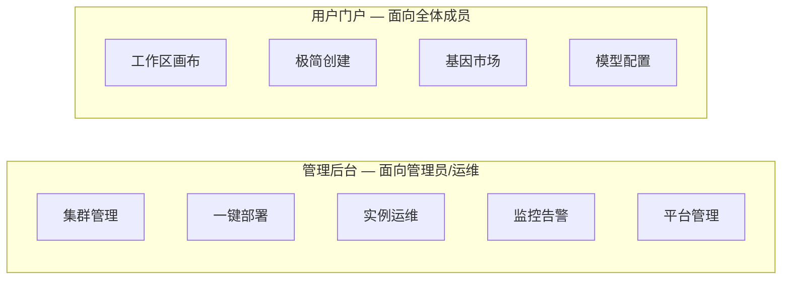
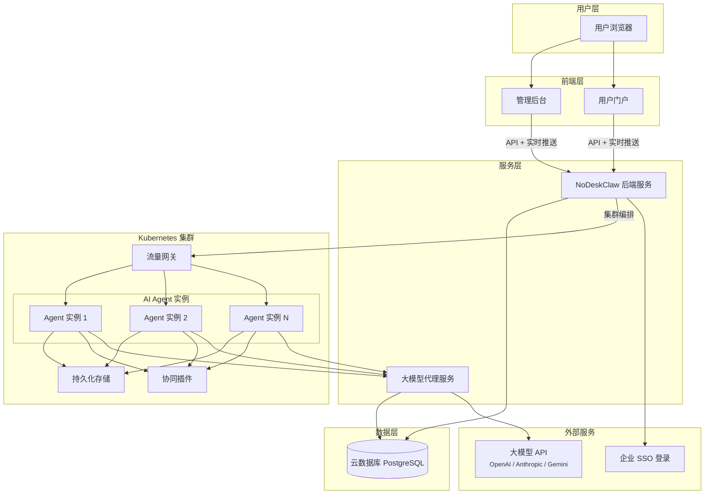
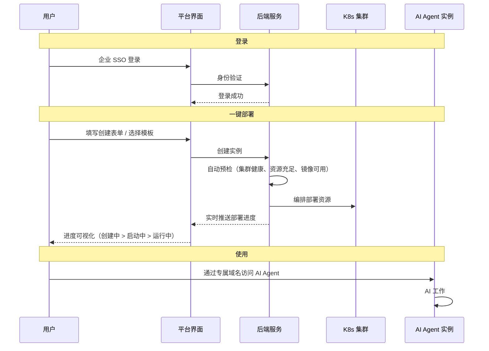
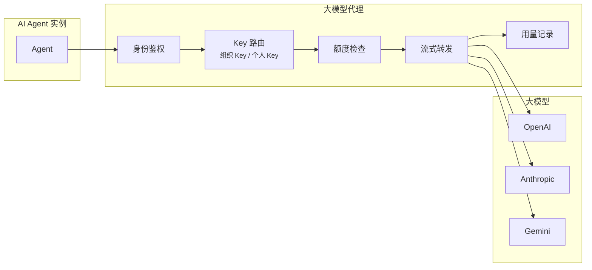

# NoDeskClaw

> OpenClaw 实例可视化管理平台 — One-click deploy, full control.

---

## 一、产品简介

NoDeskClaw 是面向企业的 **AI Agent 实例管理平台**，基于 Kubernetes 构建，为团队提供 OpenClaw（AI Agent 平台）的一站式部署、运维和协同管理能力。

**核心价值：让团队每一位成员都能拥有自己的 AI 编程助手，零门槛使用，统一管控。**

### 为什么需要 NoDeskClaw

AI Agent 平台（如 OpenClaw）功能强大，但部署和运维存在较高的技术门槛 — 需要编写 K8s 配置、执行命令行操作、排查容器异常。NoDeskClaw 将这些复杂性完全封装，让业务团队专注于使用 AI 本身：

| 传统方式 | NoDeskClaw |
|---------|-----------|
| 手动编写部署配置 | 可视化表单，一键部署 |
| 部署耗时约 30 分钟 | 页面操作 3 分钟完成 |
| 出问题需要运维人员排查 | 实时日志 + 状态面板，自助诊断 |
| API Key 分散管理 | 组织统一管理，额度可控 |
| 各实例互相独立 | 多 Agent 协同工作区 |

---

## 二、产品功能

### 2.1 双入口设计

NoDeskClaw 采用双前端架构，为不同角色提供最合适的操作界面：

### 2.2 管理后台（Admin Panel）

面向管理员和运维人员，提供完整的集群与实例管理能力：

- **集群管理** — 导入集群凭证，自动健康巡检，凭证过期提前告警
- **一键部署** — 分步引导式表单，自动预检（集群连接、资源充足、镜像可用），实时展示部署进度
- **实例管理** — 全生命周期管理（查看、重启、升级、扩容、删除），支持高级运维配置
- **实时日志** — 服务端推送的实时日志流，支持关键字搜索和级别过滤
- **监控面板** — 实例状态总览、资源使用趋势、部署历史回溯、集群事件流
- **LLM Key 管理** — 组织级和个人级 Key 管理，用量统计和额度控制
- **平台管理** — 组织管理、成员管理、套餐计划

### 2.3 用户门户（User Portal）

面向全体成员（产品、设计、运营等非技术角色），隐藏所有基础设施概念：

- **工作区** — RTS 游戏风格的蜂窝画布，可视化管理多个 AI Agent，支持 Agent 间协同、群聊、黑板共享
- **极简创建** — 选模板、起名字、完成，三步拥有自己的 AI 助手
- **基因市场** — 浏览和安装 AI Agent 的能力基因，查看进化趋势
- **模型配置** — 自助管理大模型 Key，按需切换模型

### 2.4 大模型代理

所有 AI Agent 实例的大模型调用统一经过平台代理，实现：

- **安全管控** — 实例不持有真实 API Key，通过代理 Token 鉴权
- **多模型支持** — OpenAI / Anthropic / Gemini 等主流模型统一接入
- **用量可观测** — Token 消耗实时记录，按组织/个人维度统计，额度超限自动拦截

### 2.5 Agent 协同

- **工作区消息广播** — 同一工作区内多个 AI Agent 实时通信
- **基因进化** — Agent 可通过学习（Learn）、创造（Create）、遗忘（Forget）模式持续进化能力

---

## 三、系统架构

### 3.1 整体架构

### 3.2 核心流程

### 3.3 大模型代理机制

### 3.4 技术栈

| 层级 | 技术选型 |
|------|---------|
| 前端 | Vue 3 + TypeScript + Tailwind CSS |
| 用户门户 3D 画布 | Three.js |
| 后端 | Python 3.12 + FastAPI（异步） |
| 集群管理 | Kubernetes（异步客户端） |
| 数据库 | PostgreSQL |
| 认证 | 企业 SSO（飞书）+ JWT |
| 敏感数据加密 | AES-256-GCM |
| 国际化 | 中英文双语，浏览器语言自动检测 |
| 基础设施 | 火山云 VKE + RDS + NAS |

---

## 四、产品特性

| 特性 | 说明 |
|------|------|
| **一键部署** | 可视化表单 + 自动预检，3 分钟完成实例创建 |
| **双入口** | 管理员看全貌，普通用户零门槛使用 |
| **实时可观测** | SSE 实时日志流、部署进度推送、实例状态监控 |
| **多 Agent 协同** | 工作区画布管理多个 AI Agent，支持消息广播和黑板共享 |
| **统一 Key 管控** | 组织级大模型 Key 管理，额度控制，用量可追踪 |
| **多模型支持** | OpenAI、Anthropic、Gemini 等主流大模型统一接入 |
| **基因进化** | Agent 能力市场化，支持学习、创造、遗忘三种进化模式 |
| **安全隔离** | 每个实例独立命名空间，网络隔离，敏感数据 AES 加密 |
| **国际化** | 中英文双语，前后端全链路 i18n |
| **企业级认证** | 飞书 SSO 单点登录，JWT Token 管理 |
