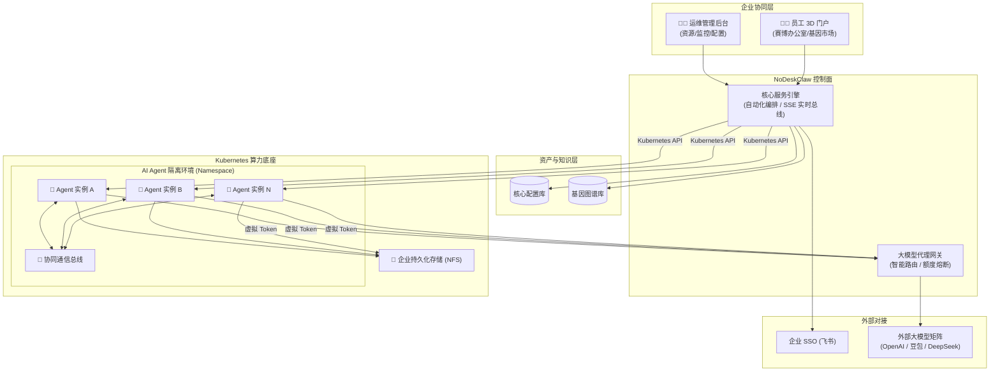

# NoDeskClaw 产品白皮书

> **为企业打造的新一代 AI Agent 操作系统**
> One-click deploy, infinite evolution.

---

## 一、产品愿景

在 AI 爆发的时代，让企业内的每个员工都能轻松拥有、管理并指挥自己的 AI 助手团队。

NoDeskClaw 是一款**基于云原生（Kubernetes）底座的企业级 AI Agent 实例管理平台**。我们不仅将复杂的底层部署缩短至 3 分钟，更首创了 3D 赛博办公室与 Agent 基因进化机制，真正实现从「部署大模型」到「管理数字员工」的跨越。

---

## 二、直击企业痛点

企业在引入和落地 AI Agent（如 OpenClaw 等开源方案）时，往往面临四大阻碍：

1. **部署门槛高**：非技术人员面对 Kubernetes、YAML、Pod 等概念束手无策，依赖 IT 部门排期，落地慢。
2. **缺乏协同感**：各个 AI 实例相互孤立，像是一座座"数据孤岛"，无法处理复杂的多 Agent 协作任务。
3. **模型资产失控**：各部门私下申请 API Key，缺乏统一监管，不仅存在安全泄露风险，还极易造成账单超限。
4. **Agent 能力固化**：部署好的 AI 助手能力一成不变，无法随着业务的发展沉淀企业专属的"领域知识"。

---

## 三、四大核心特色亮点

### 🌟 特色一：RTS 游戏级「3D 赛博办公室」

打破传统无聊的列表式管理，为非技术用户打造了极具沉浸感的用户门户（User Portal）。

- **蜂窝 3D 画布**：引入 Three.js 引擎，将 AI Agent 实例化作一个个分布在蜂窝网格上的"数字工位"。
- **群聊与黑板共享**：支持跨 Agent 消息广播（SSE 通信），多个 Agent 可以在同一块"数字黑板"上共享上下文、协同解题。
- **直观可见的工作流**：Agent 的思考、交互、任务流转都在 3D 画布上实时呈现，管理 AI 就像玩即时战略游戏一样简单直观。

### 🧬 特色二：会成长的「AI 基因进化生态」

传统的 AI 是"死"的，而 NoDeskClaw 管理的 Agent 是"活"的。

- **三模态进化引擎**：深度集成 Channel 插件，赋予 Agent **学习（Learn）**、**创造（Create）**、**遗忘（Forget）** 的能力。Agent 在解决实际问题后，会沉淀新的"技能基因"。
- **企业基因市场（Gene Market）**：员工可以将训练好的"优质基因"发布到内部市场，供其他团队下载安装，实现企业级知识资产的复用与流通。

### 🚀 特色三：零门槛的「云原生一键部署」

将 Kubernetes 强大的云原生编排能力彻底平民化。

- **千人千面的双入口**：
  - **普通用户（User Portal）**：选模板 ➔ 填名字 ➔ 一键创建。全程零 K8s 概念，3 分钟即可获得专属 AI 助手。
  - **IT 运维（Admin Panel）**：提供集群健康巡检、命名空间隔离、存储挂载配置、资源配额硬性限制等全方位掌控力。
- **全息可观测**：服务端实时推送（SSE）部署进度、终端日志流与资源监控大盘，排障无需敲命令行。

### 💰 特色四：精细化的「企业级大模型管家」

内置高性能 LLM Proxy（大模型代理网关），彻底解决模型计费与安全痛点。

- **Key 隐身模式**：OpenClaw 实例内部只持有虚拟 Proxy Token，真实 API Key（如 OpenAI、Anthropic）绝不落盘于实例中。
- **账单与额度双控**：支持组织级公区 Key 与个人 Key 分离，实时统计 Token 级消耗，设定硬性拦截阈值，杜绝天价账单。

---

## 四、解决方案架构

NoDeskClaw 采用分层解耦的云原生架构，确保平台的高可用与高扩展性。

---

## 五、企业收益与价值

1. **效率飞跃**：将 AI 助手的开通时间从**数天/数小时（提工单、配环境）压缩至 3 分钟**，即开即用。
2. **降本增效**：通过 LLM 代理网关池化管理模型 Key，有效避免资源浪费，预计可**降低 30% 以上的 API 闲置及浪费成本**。
3. **知识沉淀**：通过基因市场机制，让优秀的 AI 解决经验在企业内部自由流转，**将员工的暗知识转化为企业的明资产**。
4. **安全合规**：全链路采用云原生隔离机制，业务数据严格存储于企业私有集群（NFS），从源头阻断数据外泄。
